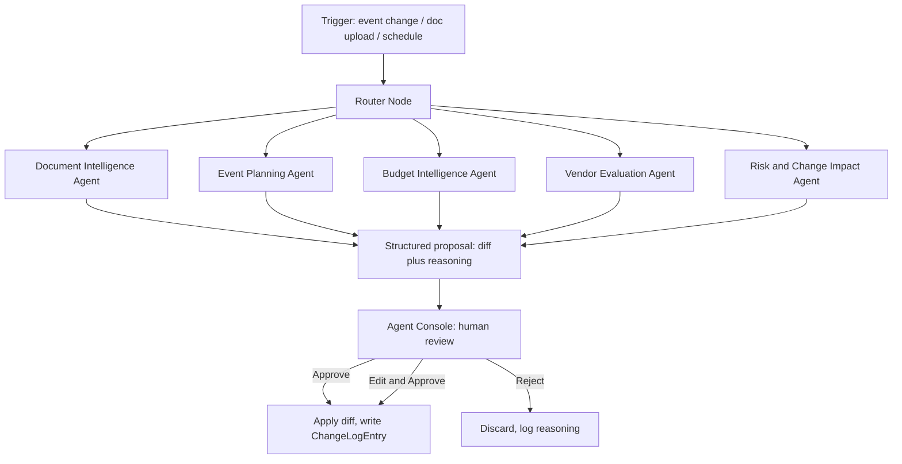

# EventOps — Product Requirements Document (v2, full spec)

**AI-powered, multi-tenant event operations platform — built for $0**

---

## 1. Executive Summary

EventOps is a multi-tenant SaaS that helps event planners and agencies run events end-to-end — vendors, budgets, timelines, guests, documents — governed by five AI agents that analyze and propose changes but never write to the database without human approval.

Every service in this stack runs on a free tier. That's a deliberate constraint, not a limitation to apologize for: it forces real architectural decisions (queueing instead of always-on workers, RLS instead of a paid auth add-on, test-mode payment/SMS providers) that are themselves good interview material.

---

## 2. Problem Statement

Planners coordinate events across disconnected tools — spreadsheets for budgets, WhatsApp for vendors, static docs for contracts. When something changes (venue falls through, guest count jumps, a vendor cancels), tracing every downstream effect is manual and error-prone. EventOps centralizes the data *and* understands the dependencies between it, so a change in one place surfaces every place it matters — with an AI that proposes fixes but never silently acts.

---

## 3. Users & Personas

Multi-tenant from day one. An **Organization** is the tenant boundary; everything else hangs off it.

| Role | Scope | Can do |
|---|---|---|
| **Owner** | Org-wide | Billing, team management, everything below |
| **Planner** | Org-wide | Create/manage events, approve agent proposals, manage vendors/budget |
| **Coordinator** | Assigned events only | Edit tasks/guests/documents on assigned events, cannot approve agent proposals |
| **Client / Vendor (External)** | Transactional / Scoped | No login required. Interacts entirely via secure **Tokenised Magic Links** for RSVP or Document Uploads. |

---

## 4. Goals & Non-Goals

**Goals (v1):** real multi-tenant SaaS with working auth, billing, and notifications; full event-ops CRUD; five governed AI agents; complete audit trail; Tokenised Magic Links for external users; deployed and seeded so a recruiter can click through it in minutes — all on free-tier infrastructure.

**Non-goals (v1):** vendor marketplace/discovery (internal CRM only for v1), native mobile apps, multi-level approval chains (single approver is enough for v1).

---

## 5. Full Data Model

Postgres via Supabase. Tenant isolation enforced with **Row-Level Security keyed on `organization_id`**, not just app-layer filtering. Below is the full schema as Django models — copy these directly as your starting `models.py`.

### 5.1 Organizations & Membership

```python
class Organization(models.Model):
    id = models.UUIDField(primary_key=True, default=uuid.uuid4)
    name = models.CharField(max_length=255)
    slug = models.SlugField(unique=True)
    plan = models.CharField(
        max_length=20,
        choices=[("free", "Free"), ("pro", "Pro"), ("agency", "Agency")],
        default="free",
    )
    stripe_customer_id = models.CharField(max_length=255, blank=True, null=True)
    stripe_subscription_id = models.CharField(max_length=255, blank=True, null=True)
    created_at = models.DateTimeField(auto_now_add=True)


class Membership(models.Model):
    ROLE_CHOICES = [
        ("owner", "Owner"),
        ("planner", "Planner"),
        ("coordinator", "Coordinator"),
        ("viewer", "Viewer"),
    ]
    id = models.UUIDField(primary_key=True, default=uuid.uuid4)
    organization = models.ForeignKey(
        Organization, on_delete=models.CASCADE, related_name="memberships"
    )
    user = models.ForeignKey(settings.AUTH_USER_MODEL, on_delete=models.CASCADE)
    role = models.CharField(max_length=20, choices=ROLE_CHOICES)
    created_at = models.DateTimeField(auto_now_add=True)

    class Meta:
        unique_together = ("organization", "user")
```

### 5.2 Vendors

```python
class Vendor(models.Model):
    CATEGORY_CHOICES = [
        ("venue", "Venue"),
        ("catering", "Catering"),
        ("decor", "Decor"),
        ("photography", "Photography"),
        ("entertainment", "Entertainment"),
        ("transport", "Transport"),
        ("other", "Other"),
    ]
    id = models.UUIDField(primary_key=True, default=uuid.uuid4)
    organization = models.ForeignKey(
        Organization, on_delete=models.CASCADE, related_name="vendors"
    )
    name = models.CharField(max_length=255)
    category = models.CharField(max_length=30, choices=CATEGORY_CHOICES)
    contact_name = models.CharField(max_length=255, blank=True)
    contact_email = models.EmailField(blank=True)
    contact_phone = models.CharField(max_length=30, blank=True)
    avg_rating = models.DecimalField(max_digits=3, decimal_places=2, default=0)
    notes = models.TextField(blank=True)
    created_at = models.DateTimeField(auto_now_add=True)
```

### 5.3 Events

```python
class Event(models.Model):
    STATUS_CHOICES = [
        ("planning", "Planning"),
        ("confirmed", "Confirmed"),
        ("in_progress", "In Progress"),
        ("completed", "Completed"),
        ("cancelled", "Cancelled"),
    ]
    id = models.UUIDField(primary_key=True, default=uuid.uuid4)
    organization = models.ForeignKey(
        Organization, on_delete=models.CASCADE, related_name="events"
    )
    name = models.CharField(max_length=255)
    event_type = models.CharField(
        max_length=50
    )  # wedding, corporate, birthday, conference...
    status = models.CharField(max_length=20, choices=STATUS_CHOICES, default="planning")
    venue_name = models.CharField(max_length=255, blank=True)
    event_date = models.DateTimeField()
    expected_guest_count = models.PositiveIntegerField(default=0)
    total_budget = models.DecimalField(max_digits=12, decimal_places=2, default=0)
    primary_planner = models.ForeignKey(
        settings.AUTH_USER_MODEL, on_delete=models.SET_NULL, null=True
    )
    client_share_token = models.UUIDField(
        default=uuid.uuid4, unique=True
    )  # for read-only client link
    created_at = models.DateTimeField(auto_now_add=True)
    updated_at = models.DateTimeField(auto_now=True)

class SubEvent(models.Model):
    id = models.UUIDField(primary_key=True, default=uuid.uuid4)
    event = models.ForeignKey(Event, on_delete=models.CASCADE, related_name="sub_events")
    name = models.CharField(max_length=255) # e.g. "Day 1 Conference"
    start_time = models.DateTimeField()
    end_time = models.DateTimeField()
    venue_name = models.CharField(max_length=255, blank=True)
```

### 5.4 Tasks & Timeline

```python
class Task(models.Model):
    STATUS_CHOICES = [
        ("todo", "To Do"),
        ("in_progress", "In Progress"),
        ("blocked", "Blocked"),
        ("done", "Done"),
    ]
    id = models.UUIDField(primary_key=True, default=uuid.uuid4)
    event = models.ForeignKey(Event, on_delete=models.CASCADE, related_name="tasks")
    title = models.CharField(max_length=255)
    description = models.TextField(blank=True)
    status = models.CharField(max_length=20, choices=STATUS_CHOICES, default="todo")
    assignee = models.ForeignKey(
        settings.AUTH_USER_MODEL, on_delete=models.SET_NULL, null=True
    )
    due_date = models.DateTimeField(null=True, blank=True)
    depends_on = models.ManyToManyField(
        "self", symmetrical=False, blank=True, related_name="blocks"
    )
    created_by_agent = models.BooleanField(default=False)
    created_at = models.DateTimeField(auto_now_add=True)
```

### 5.5 Budget

```python
class BudgetCategory(models.Model):
    id = models.UUIDField(primary_key=True, default=uuid.uuid4)
    event = models.ForeignKey(
        Event, on_delete=models.CASCADE, related_name="budget_categories"
    )
    name = models.CharField(max_length=100)  # Venue, Catering, Decor...
    planned_amount = models.DecimalField(max_digits=12, decimal_places=2)


class BudgetLineItem(models.Model):
    id = models.UUIDField(primary_key=True, default=uuid.uuid4)
    category = models.ForeignKey(
        BudgetCategory, on_delete=models.CASCADE, related_name="line_items"
    )
    vendor = models.ForeignKey(Vendor, on_delete=models.SET_NULL, null=True, blank=True)
    description = models.CharField(max_length=255)
    planned_amount = models.DecimalField(max_digits=12, decimal_places=2)
    actual_amount = models.DecimalField(max_digits=12, decimal_places=2, default=0)
    paid = models.BooleanField(default=False)
    created_at = models.DateTimeField(auto_now_add=True)

class InventoryBlock(models.Model):
    id = models.UUIDField(primary_key=True, default=uuid.uuid4)
    line_item = models.ForeignKey(BudgetLineItem, on_delete=models.CASCADE, related_name="inventory")
    name = models.CharField(max_length=255) # e.g. "King Bed Room Block"
    quantity = models.PositiveIntegerField(default=1)
    status = models.CharField(max_length=50, default="held")
```

### 5.6 Guests

```python
class GuestHousehold(models.Model):
    id = models.UUIDField(primary_key=True, default=uuid.uuid4)
    event = models.ForeignKey(
        Event, on_delete=models.CASCADE, related_name="households"
    )
    name = models.CharField(max_length=255)
    max_size = models.PositiveIntegerField(default=1)


class Guest(models.Model):
    RSVP_CHOICES = [
        ("pending", "Pending"),
        ("yes", "Yes"),
        ("no", "No"),
        ("maybe", "Maybe"),
    ]
    id = models.UUIDField(primary_key=True, default=uuid.uuid4)
    household = models.ForeignKey(
        GuestHousehold, on_delete=models.CASCADE, related_name="guests"
    )
    full_name = models.CharField(max_length=255)
    rsvp_status = models.CharField(
        max_length=10, choices=RSVP_CHOICES, default="pending"
    )
    dietary_notes = models.CharField(max_length=255, blank=True)
    accessibility_notes = models.CharField(max_length=255, blank=True)
```

### 5.7 Vendor Bookings & Documents

```python
class VendorBooking(models.Model):
    STATUS_CHOICES = [
        ("inquired", "Inquired"),
        ("quoted", "Quoted"),
        ("contracted", "Contracted"),
        ("confirmed", "Confirmed"),
        ("cancelled", "Cancelled"),
    ]
    id = models.UUIDField(primary_key=True, default=uuid.uuid4)
    event = models.ForeignKey(
        Event, on_delete=models.CASCADE, related_name="vendor_bookings"
    )
    vendor = models.ForeignKey(
        Vendor, on_delete=models.CASCADE, related_name="bookings"
    )
    status = models.CharField(max_length=20, choices=STATUS_CHOICES, default="inquired")
    quoted_amount = models.DecimalField(
        max_digits=12, decimal_places=2, null=True, blank=True
    )
    contract_terms = models.JSONField(
        default=dict, blank=True
    )  # extracted by Document Intelligence Agent
    created_at = models.DateTimeField(auto_now_add=True)


class Document(models.Model):
    DOC_TYPE_CHOICES = [
        ("contract", "Contract"),
        ("quote", "Quote"),
        ("floor_plan", "Floor Plan"),
        ("other", "Other"),
    ]
    id = models.UUIDField(primary_key=True, default=uuid.uuid4)
    event = models.ForeignKey(Event, on_delete=models.CASCADE, related_name="documents")
    vendor_booking = models.ForeignKey(
        VendorBooking, on_delete=models.SET_NULL, null=True, blank=True
    )
    doc_type = models.CharField(max_length=20, choices=DOC_TYPE_CHOICES)
    file_path = models.CharField(max_length=500)  # Supabase Storage path
    version = models.PositiveIntegerField(default=1)
    uploaded_by = models.ForeignKey(
        settings.AUTH_USER_MODEL, on_delete=models.SET_NULL, null=True
    )
    uploaded_at = models.DateTimeField(auto_now_add=True)
```

### 5.8 Agent Runs & Audit Log — the governance core

```python
class AgentRun(models.Model):
    AGENT_CHOICES = [
        ("document_intelligence", "Document Intelligence"),
        ("event_planning", "Event Planning"),
        ("budget_intelligence", "Budget Intelligence"),
        ("vendor_evaluation", "Vendor Evaluation"),
        ("risk_change_impact", "Risk & Change Impact"),
    ]
    STATE_CHOICES = [
        ("pending", "Pending Review"),
        ("approved", "Approved"),
        ("rejected", "Rejected"),
        ("edited_approved", "Edited & Approved"),
    ]
    id = models.UUIDField(primary_key=True, default=uuid.uuid4)
    event = models.ForeignKey(
        Event, on_delete=models.CASCADE, related_name="agent_runs"
    )
    agent_type = models.CharField(max_length=30, choices=AGENT_CHOICES)
    trigger = models.CharField(
        max_length=255
    )  # what caused this run, e.g. "vendor_cancelled"
    input_snapshot = models.JSONField()  # DB state passed into the agent
    reasoning = models.TextField()  # agent's explanation
    proposed_diff = models.JSONField()  # structured before/after
    final_diff = models.JSONField(
        null=True, blank=True
    )  # what was actually applied, if edited
    state = models.CharField(max_length=20, choices=STATE_CHOICES, default="pending")
    reviewed_by = models.ForeignKey(
        settings.AUTH_USER_MODEL, on_delete=models.SET_NULL, null=True, blank=True
    )
    reviewed_at = models.DateTimeField(null=True, blank=True)
    created_at = models.DateTimeField(auto_now_add=True)


class ChangeLogEntry(models.Model):
    ACTOR_TYPE_CHOICES = [("user", "User"), ("agent", "Agent")]
    id = models.UUIDField(primary_key=True, default=uuid.uuid4)
    event = models.ForeignKey(
        Event, on_delete=models.CASCADE, related_name="change_log"
    )
    actor_type = models.CharField(max_length=10, choices=ACTOR_TYPE_CHOICES)
    actor_id = models.CharField(max_length=255)  # user id or agent_type
    entity_type = models.CharField(max_length=50)  # "Task", "BudgetLineItem", etc.
    entity_id = models.UUIDField()
    before = models.JSONField(null=True)
    after = models.JSONField(null=True)
    agent_run = models.ForeignKey(
        AgentRun, on_delete=models.SET_NULL, null=True, blank=True
    )
    created_at = models.DateTimeField(auto_now_add=True)
```

### 5.9 Notifications

```python
class Notification(models.Model):
    CHANNEL_CHOICES = [("email", "Email"), ("sms", "SMS"), ("in_app", "In-App")]
    id = models.UUIDField(primary_key=True, default=uuid.uuid4)
    organization = models.ForeignKey(Organization, on_delete=models.CASCADE)
    user = models.ForeignKey(settings.AUTH_USER_MODEL, on_delete=models.CASCADE)
    channel = models.CharField(max_length=10, choices=CHANNEL_CHOICES)
    subject = models.CharField(max_length=255)
    body = models.TextField()
    sent = models.BooleanField(default=False)
    created_at = models.DateTimeField(auto_now_add=True)

class Message(models.Model):
    # Omnichannel Communication Log (Email/WhatsApp)
    CHANNEL_CHOICES = [("email", "Email"), ("whatsapp", "WhatsApp")]
    DIRECTION_CHOICES = [("inbound", "Inbound"), ("outbound", "Outbound")]
    id = models.UUIDField(primary_key=True, default=uuid.uuid4)
    event = models.ForeignKey(Event, on_delete=models.CASCADE, related_name="messages")
    vendor = models.ForeignKey(Vendor, on_delete=models.SET_NULL, null=True, blank=True)
    channel = models.CharField(max_length=20, choices=CHANNEL_CHOICES)
    direction = models.CharField(max_length=20, choices=DIRECTION_CHOICES)
    content = models.TextField()
    raw_payload = models.JSONField(default=dict)
    created_at = models.DateTimeField(auto_now_add=True)
```

### 5.10 Row-Level Security (Supabase)

Every tenant-scoped table gets a policy shaped like this — write one migration per table:

```sql
alter table events enable row level security;

create policy "org_members_select" on events
  for select using (
    organization_id in (
      select organization_id from memberships where user_id = auth.uid()
    )
  );

create policy "org_planners_write" on events
  for insert, update, delete using (
    organization_id in (
      select organization_id from memberships
      where user_id = auth.uid() and role in ('owner','planner')
    )
  );
```

Repeat per table (`vendors`, `tasks`, `budget_categories`, `guests`, `documents`, `agent_runs`, `change_log`...), narrowing the write policy further for `Coordinator` role where relevant (only assigned events). Client share-link access (`client_share_token`) bypasses RLS via a dedicated read-only service-role endpoint in Django, never by relaxing RLS itself.

---

## 6. Feature List

### 6.1 Core Platform
Auth (email/password + Google OAuth) · org creation & team invites · RBAC · Stripe subscription billing (Free/Pro/Agency tiers) · event CRUD · task/timeline management with dependencies (Kanban + Gantt view) · budget management (planned vs actual, category rollups) · shared vendor directory · vendor booking per event · guest list with RSVP & dietary/accessibility notes · document upload with versioning · email + SMS notifications · full activity/audit log · cross-event dashboard (upcoming deadlines, budget health, pending approvals) · read-only client share link.

### 6.2 AI Agent Layer & Integrations
Document Intelligence Agent · Event Planning Agent · Budget Intelligence Agent · AI Vendor Negotiator (Quote Benchmarking) · Risk & Change Impact Agent · MCP (Model Context Protocol) Server for external LLM access.

### 6.3 Phase 5: External Portals & Omnichannel
Tokenised Magic Links (JWT) for secure, no-login Guest RSVPs and Vendor Document Uploads · WhatsApp/Twilio Inbound Message parsing for the AI agent.

---

## 7. Standout Features (lead with these in interviews)

**1. Governed multi-agent pipeline.** Five LangGraph agents, zero direct database writes. Every proposal is a structured diff + reasoning trace sitting in the Agent Console until a human approves, rejects, or edits it. This is the single strongest signal of senior-level AI-systems thinking in the project.

**2. Risk & Change Impact Agent.** Your best live demo: change a vendor or event date and watch it compute the dependency graph — affected tasks, budget gap, downstream vendors — with a remediation proposal sitting right next to it.

**3. Full audit & governance trail.** Every agent proposal, accepted or rejected, is permanently logged with its reasoning (`AgentRun` + `ChangeLogEntry`). Frame this as "AI observability and accountability" — a live concern for any company hiring AI-adjacent engineers right now.

---

## 8. Agent Architecture (LangGraph)



### 8.1 Shared graph state

```python
class AgentState(TypedDict):
    event_id: str
    trigger: str  # e.g. "vendor_cancelled", "budget_edited", "doc_uploaded"
    db_snapshot: dict  # relevant event/tasks/budget/vendors, read-only
    prior_outputs: dict  # other agents' outputs this run, so Risk agent can see Budget agent's numbers
    proposal: dict | None  # final structured diff
    reasoning: str | None
```

### 8.2 Per-agent spec

| Agent | Reads | Proposes | Notes |
|---|---|---|---|
| **Document Intelligence (Vendor Negotiator)** | Uploaded PDF (contract/quote) | Extracts structured line items, compares to budget & historical benchmarks (`pgvector`), drafts negotiation email/WhatsApp | Use a free-tier multimodal model (Gemini 1.5 Flash) |
| **Event Planning** | Event type, date, budget, headcount | Draft `Task` list + rough timeline | Runs once on event creation |
| **Budget Intelligence** | All `BudgetLineItem`s for the event | Reallocation suggestions, overrun flags, forecast final cost | Runs on budget edit or nightly via scheduled job |
| **Risk & Change Impact** | Full event snapshot (tasks, budget, vendors) | Impact summary + remediation plan | Runs on material field changes |

### 8.3 Tooling rule

Every agent gets **read-only** DB tools (via LangGraph tool calls) scoped to its event's `organization_id`. The **only** write path in the entire system is a single `apply_agent_proposal(agent_run_id, approved_by)` service function, called exclusively from the Agent Console approval endpoint. This single-write-path design is worth stating explicitly in your README — it's the cleanest way to demonstrate "agents that can't go rogue."

---

## 9. API Surface (Django REST Framework, high level)

```
/api/auth/...                        Supabase-issued JWT validated by DRF middleware
/api/orgs/                           org CRUD, /invite, /members
/api/events/                         CRUD, /events/{id}/share-link (read-only client view)
/api/events/{id}/tasks/              CRUD, supports depends_on
/api/events/{id}/budget/             categories + line items
/api/events/{id}/guests/             households + guests
/api/vendors/                        org-wide directory
/api/events/{id}/vendor-bookings/    CRUD
/api/events/{id}/documents/          upload -> Supabase Storage, triggers Document Intelligence Agent
/api/events/{id}/agent-runs/         list, /agent-runs/{id}/approve, /reject, /edit-approve
/api/events/{id}/change-log/         read-only audit trail
/api/mcp/                            Model Context Protocol server for external agent access
/api/webhooks/stripe/                Stripe billing webhook
/api/webhooks/twilio/                WhatsApp inbound message parsing
```

Agent triggers are fired from Django signal handlers / service-layer calls (e.g. saving an `Event` with a changed `event_date` enqueues a Risk & Change Impact run) rather than baked into serializers — keeps the agent layer swappable.

---

## 10. Zero-Cost Tech Stack

Every row below has a free tier sufficient for a portfolio-scale demo (seeded org, ~20 events, a handful of users).

| Layer | Choice | Free tier basis |
|---|---|---|
| Frontend hosting | **Vercel** | Free Hobby tier — plenty for a demo SPA |
| Frontend | React + TypeScript, Vite, TanStack Query, shadcn/ui | No cost, open source |
| Backend hosting | **Render** (free web service) or **Railway** free trial credits | Free tier sleeps on idle — fine for a demo, mention this trade-off openly in your README |
| Backend | Django + DRF | Open source |
| Agent orchestration | LangGraph (Python), run inside the Django backend or a separate free Render service | Open source |
| LLM | **Groq free tier** (fast Llama models) for reasoning agents; **Gemini 1.5 Flash free tier** for the Document Intelligence Agent (native PDF understanding) | Both have generous no-cost developer tiers |
| Database | **Supabase free tier** (Postgres, 500MB) | Includes Auth, Storage, RLS |
| Auth | **Supabase Auth** | Included in free tier; pairs natively with RLS via `auth.uid()` |
| File storage | **Supabase Storage free tier** (1GB) | Contracts, quotes, floor plans |
| Payments | **Stripe test mode** | Free — real integration code, no real charges |
| SMS | **Twilio free trial credit** | Enough for demo notifications; label clearly as trial in README |
| Email | **Resend free tier** (3,000 emails/month) | Task deadline / approval-request emails |
| CI/CD | **GitHub Actions** free tier | Lint, test, deploy on merge |
| Error monitoring | **Sentry free tier** | Error tracking |
| Background jobs | Django management command on a **free cron trigger** (GitHub Actions scheduled workflow, or Render's free cron) instead of a paid worker dyno | Avoids needing a paid Celery worker |

**Total infrastructure cost: $0/month** at demo scale. Call this out explicitly in your README — architecting a genuinely production-shaped system entirely within free tiers is itself a skill worth naming.

---

## 11. Non-Functional Requirements

- **Tenant isolation:** Postgres RLS on every tenant-scoped table, not just app-layer filters.
- **Auditability:** every mutation, human or agent, produces an immutable `ChangeLogEntry`.
- **Single write path for agents:** all agent-originated writes go through one gated service function.
- **Idempotency:** applying an approved `AgentRun` twice must not double-write.
- **Security:** verify Stripe/Twilio webhook signatures; secrets via environment variables, never committed; DRF permission classes enforcing role checks on every write endpoint.
- **Cold-start awareness:** free-tier backend hosting sleeps on idle — document this trade-off and, if desired, add a lightweight uptime-ping (e.g. a free GitHub Actions cron hitting `/health` every 10 min) to keep the demo responsive for recruiters.

---

## 12. Build Sequence

1. **Foundation:** Supabase schema + RLS policies, Django + DRF skeleton, Supabase Auth wired in, deploy pipeline working end-to-end (empty app in production first).
2. **Core CRUD:** events, tasks/timeline, budget, vendors, guests, documents — fully functional, no AI yet.
3. **Real integrations (test-mode):** Stripe billing, Resend email, Twilio SMS.
4. **Agent Console + Risk & Change Impact Agent** end-to-end first — best demo, proves the human-in-the-loop pattern.
5. **Remaining four agents** once the pattern is proven.
6. **Polish:** seeded demo org, README with architecture diagram, 2–3 min walkthrough video, deployed live link, note on the $0 infra design.

---

## 13. Open Questions

1. **LangGraph deployment:** inside the Django app (simpler) vs. a separate free-tier service (stronger "polyglot architecture" story, pairs well with your FlashTix microservices experience). Either works within $0 constraints.
2. **Free-tier cold starts:** acceptable for a portfolio demo, but decide now whether to add the uptime-ping workaround before you're demoing live to a recruiter.
3. **Groq vs Gemini as primary reasoning model:** Groq is faster for the four reasoning agents; Gemini is needed for direct PDF understanding in the Document Intelligence Agent. Recommendation: both, split by task as shown in §10.

---

## 14. Resume/Interview Framing

Lead with: *"Built EventOps, a multi-tenant event operations SaaS with a governed multi-agent system (LangGraph) that proposes budget reallocation, vendor risk, and schedule-impact fixes — every write gated behind human approval, with a full audit trail — architected entirely on free-tier infrastructure."*

Be ready to go deep on: Postgres RLS for tenant isolation, the single-write-path pattern for agent safety, and the specific trade-offs of building a production-shaped system at $0 cost.
