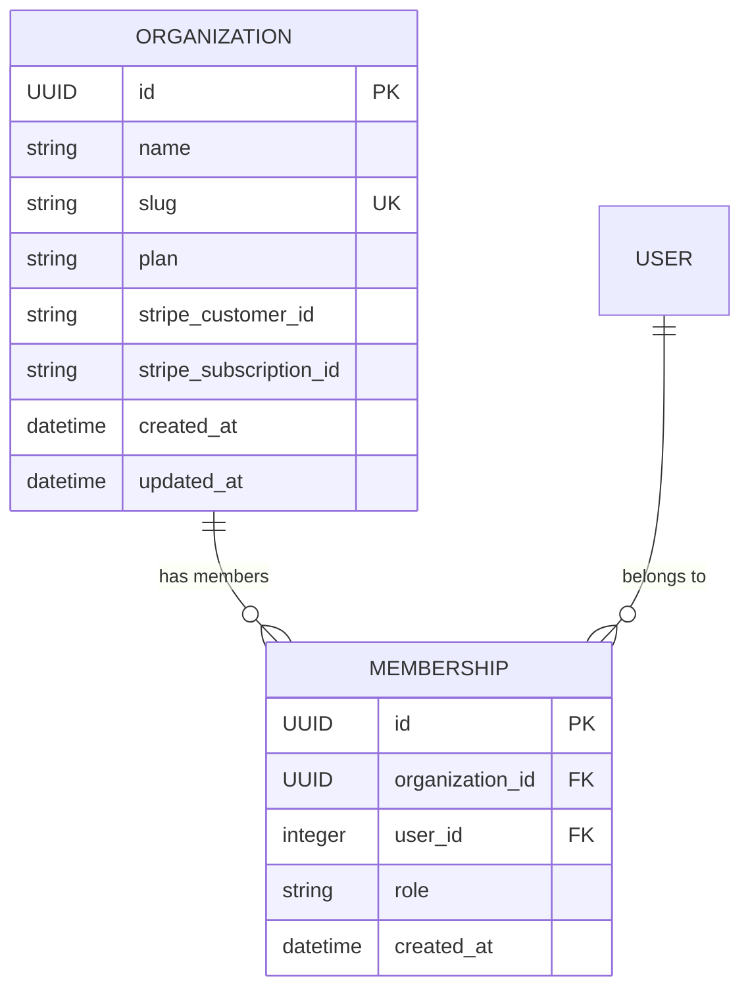

# EventOps Data Model (Living Document)

This document records the implemented data schema, field specifications, relationships, and constraints in EventOps. It is updated incrementally with each feature.

---

## 1. Abstract Base Models (`apps.core.models`)

### `UUIDModel`
Provides a cryptographically secure 128-bit UUID primary key for every entity.
* **`id`** (`UUIDField`, Primary Key, `default=uuid.uuid4`, `editable=False`):
  * Prevents ID enumeration and IDOR (Insecure Direct Object Reference) vulnerabilities.
  * Allows IDs to be safely generated before database insertion.

### `TimeStampedModel`
Provides standardized audit timestamps.
* **`created_at`** (`DateTimeField`, `auto_now_add=True`, `editable=False`): Recorded upon initial row creation.
* **`updated_at`** (`DateTimeField`, `auto_now=True`, `editable=False`): Automatically updated on every `.save()`.

### `TenantModel`
Abstract base class inheriting `UUIDModel` and `TimeStampedModel` for all tenant-scoped business entities (Events, Vendors, Budgets, Tasks).
* **`organization`** (`ForeignKey -> organizations.Organization`, `on_delete=CASCADE`, `db_index=True`, `related_name="%(app_label)s_%(class)ss"`):
  * Strictly binds every operational record to a parent `Organization`.
  * Database-indexed (`db_index=True`) to optimize ubiquitous multi-tenant filtering (`WHERE organization_id = ...`).
  * Dynamic `related_name` prevents reverse-relation naming collisions across child models.

---

## 2. Multi-Tenant Boundary (`apps.organizations.models`)

### `Organization`
The tenant boundary for all business data (events, tasks, vendors, budgets, guest lists).
* **`id`** (`UUIDField`, PK): Inherited from `UUIDModel`.
* **`name`** (`CharField(max_length=255)`): Organization display name.
* **`slug`** (`SlugField`, `unique=True`): URL-safe identifier (e.g. `/org/acme-events/`).
* **`plan`** (`CharField(max_length=20)`, default=`free`):
  * Choices: `free` (Free), `pro` (Pro), `agency` (Agency).
* **`stripe_customer_id`** (`CharField(max_length=255)`, nullable): Customer ID in Stripe Billing.
* **`stripe_subscription_id`** (`CharField(max_length=255)`, nullable): Active Stripe subscription reference.
* **`created_at`**, **`updated_at`**: Inherited from `TimeStampedModel`.

### `Membership`
Represents a User's role and authorization within a specific Organization.
* **`id`** (`UUIDField`, PK): Inherited from `UUIDModel`.
* **`organization`** (`ForeignKey -> Organization`, `on_delete=CASCADE`, `related_name="memberships"`): Parent tenant.
* **`user`** (`ForeignKey -> settings.AUTH_USER_MODEL`, `on_delete=CASCADE`, `related_name="memberships"`): Linked user.
* **`role`** (`CharField(max_length=20)`):
  * `owner`: Full organizational control, billing, member invites.
  * `planner`: Full event CRUD, budget management, agent proposal approvals.
  * `coordinator`: Assigned event tasks and guest management; cannot approve agent proposals.
  * `viewer`: Read-only organizational access.
* **`created_at`** (`DateTimeField`, `auto_now_add=True`).
* **Constraints**:
  * `unique_together = ("organization", "user")`: Enforces that a user has at most one membership role per organization.
